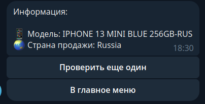

# IMEI BOT
                                                      
<details>
<summary>ТЗ</summary>

1. **Общее описание**<br>
Необходимо разработать бэкенд-систему для проверки IMEI устройств, которая будет интегрирована с Telegram-ботом и предоставлять API для внешних запросов. В рамках тестового задания необходимо реализовать базовую работу с одним сервисом.
2. **Функционал**<br>

    2.1 Доступ

    - Белый список пользователей для Telegram:
    Реализовать белый список для доступа к функционалу бота.

    - Авторизация через API:
    Реализовать авторизацию по токену для доступа к API.

    2.2 Telegram-бот
    - Пользователь отправляет боту IMEI.

    - Бот должен:
        - Проверить IMEI на валидность.
        - Отправить в ответ информацию о IMEI.

    2.3 Запросы API (пример)<br>
    
       Запрос на получение списка услуг:
       Метод: POST /api/check-imei
       Параметры запроса:
       imei (строка, обязательный) — IMEI устройства.
       token (строка, обязательный) — токен авторизации.
    
       Ответ:
       JSON с информацией о IMEI.

3. Список сервисов
В рамках тестового задания достаточно реализовать работу с одним сервисом:
https://imeicheck.net/

Документация: https://imeicheck.net/promo-api

</details>

<hr>

### Установка

- Требования: установленный пакетный менеджер `uv` (инструкции по установке <a href="https://docs.astral.sh/uv/getting-started/installation/#uv">здесь</a>)

Запустить команды:

```
git clone https://github.com/OneHandedPirate/hatiko-test.git
cd hatiko-test
uv sync --no-dev
touch .env
```

В файле `.env` прописать следующие переменные:
```
TG_BOT__TOKEN - токен бота
TG_BOT__ALLOWED_USERS - список tg_id разрешенных пользователей ([6456456456, 53453453])

IMEI_API__TOKEN - токен для https://imeicheck.net/ (Я использовал API Live токен)

API__TOKEN - API токен внутреннего сервиса
```

### Запуск
- Осуществляется командой `make start` (запускает API и бота одновременно).


### Примечания:
- Бот проверяет вводимый IMEI на валидности и предоставляет информацию о модели телефона и стране его продаже.<br><br>

                                                
